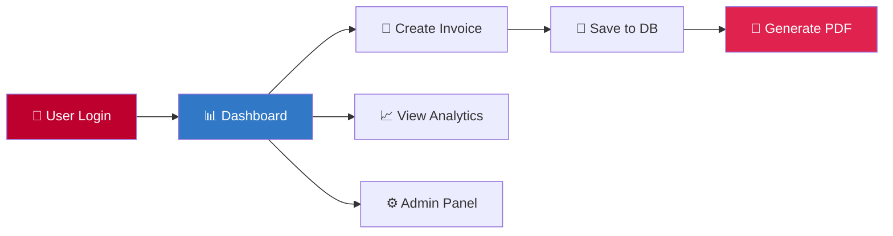

<div align="center">

# 🧾 Invoice Automation Platform

### *Professional invoice management reimagined*

[](https://angular.io/)
[](https://nestjs.com/)
[](https://www.typescriptlang.org/)
[](https://www.postgresql.org/)

**End-to-end invoice management with JWT authentication, real-time analytics, PDF generation, and comprehensive admin tooling.**

[Features](#-features) • [Quick Start](#-quick-start) • [Architecture](#-architecture) • [API Reference](#-api-reference) • [Contributing](#-contributing)

---

</div>

## ✨ User Interface

<div align="center">

<table>
<tr>
<td width="50%">

<p><em>📊 Analytics Dashboard</em></p>
</td>
<td width="50%">

<p><em>📝 Invoice Management</em></p>
</td>
</tr>
<tr>
<td width="50%">

<p><em>🧾 PDF Generation</em></p>
</td>
<td width="50%">

<p><em>📄 Invoice Details</em></p>
</td>
</tr>
</table>

</div>

---

## ✨ Features

<table>
<tr>
<td width="50%">

### 🎨 **Modern Frontend**
- ⚡ Angular 20 standalone components
- 🎯 Tailwind CSS + Flowbite UI
- 📊 Interactive charts with Chart.js
- 🔐 JWT-based authentication
- 📱 Fully responsive design

</td>
<td width="50%">

### 🚀 **Powerful Backend**
- 🏗️ NestJS 11 architecture
- 🗄️ PostgreSQL with TypeORM
- 📄 PDF generation with PDFKit
- 🛡️ Role-based access control
- 📈 Real-time analytics endpoints

</td>
</tr>
</table>

---

## 🎯 Highlights



- ✅ **Intuitive UX** - Clean, modern interface for seamless invoice management
- ✅ **Enterprise-Ready** - Robust authentication, validation, and error handling
- ✅ **Analytics Dashboard** - Visualize revenue trends and key metrics
- ✅ **PDF Customization** - Brand your invoices with custom headers and notes
- ✅ **Admin Console** - Comprehensive user and activity management
- ✅ **Type-Safe** - Shared TypeScript models across frontend and backend

---

## 📁 Project Structure

```
📦 invoice-automation-platform
├── 🎨 invoice-app/              # Angular 20 Frontend
│   ├── src/
│   │   ├── app/
│   │   │   ├── auth/            # Authentication components
│   │   │   ├── dashboard/       # Dashboard & analytics
│   │   │   ├── invoices/        # Invoice CRUD operations
│   │   │   ├── admin/           # Admin console
│   │   │   └── shared/          # Shared services & guards
│   │   └── assets/
│   └── tailwind.config.js
│
└── 🚀 invoice-backend/          # NestJS 11 API
    ├── src/
    │   ├── auth/                # JWT authentication
    │   ├── invoices/            # Invoice management
    │   ├── chart/               # Analytics endpoints
    │   ├── pdf/                 # PDF generation
    │   ├── admin/               # Admin operations
    │   └── database/            # TypeORM configuration
    └── test/
```

---

## 🏗️ Architecture

<div align="center">

```
┌─────────────────────────────────────────────────────────────┐
│                     Angular Frontend                        │
│  ┌──────────┐  ┌──────────┐  ┌──────────┐  ┌──────────┐   │
│  │   Auth   │  │ Invoice  │  │Dashboard │  │  Admin   │   │
│  │ Service  │  │ Service  │  │ Service  │  │ Service  │   │
│  └────┬─────┘  └────┬─────┘  └────┬─────┘  └────┬─────┘   │
│       │             │              │             │          │
│       └─────────────┴──────────────┴─────────────┘          │
│                          │                                   │
│                  JWT Auth Interceptor                        │
└──────────────────────────┼──────────────────────────────────┘
                           │
                    REST API (HTTPS)
                           │
┌──────────────────────────▼──────────────────────────────────┐
│                     NestJS Backend                          │
│  ┌──────────┐  ┌──────────┐  ┌──────────┐  ┌──────────┐   │
│  │   Auth   │  │ Invoice  │  │  Chart   │  │   PDF    │   │
│  │ Module   │  │ Module   │  │ Module   │  │ Module   │   │
│  └────┬─────┘  └────┬─────┘  └────┬─────┘  └────┬─────┘   │
│       │             │              │             │          │
│       └─────────────┴──────────────┴─────────────┘          │
│                          │                                   │
│                    TypeORM Layer                             │
└──────────────────────────┼──────────────────────────────────┘
                           │
                           ▼
                  ┌─────────────────┐
                  │   PostgreSQL    │
                  │    Database     │
                  └─────────────────┘
```

</div>

---

## 🚀 Quick Start

### Prerequisites

| Tool | Version | Purpose |
|------|---------|---------|
| 🟢 Node.js | ≥ 20.0 | Runtime environment |
| 📦 npm | ≥ 10.0 | Package manager |
| 🐘 PostgreSQL | ≥ 14.0 | Database |
| 🅰️ Angular CLI | Latest | Development tooling |

### Installation

**1️⃣ Clone the repository**

```bash
git clone <repository-url>
cd invoice-automation-platform
```

**2️⃣ Configure environment variables**

Create `invoice-backend/.env`:

```env
# Server Configuration
NODE_ENV=development
PORT=3000

# JWT Configuration
JWT_SECRET=your-super-secret-jwt-key-change-this
JWT_EXPIRES_IN=1d

# Database Configuration
DB_HOST=localhost
DB_PORT=5432
DB_USERNAME=postgres
DB_PASSWORD=your-password
DB_DATABASE=invoice_db
```

**3️⃣ Install dependencies**

```bash
# Backend dependencies
cd invoice-backend
npm install

# Frontend dependencies
cd ../invoice-app
npm install
```

**4️⃣ Verify database connection**

```bash
cd invoice-backend
npm run check:db
```

**5️⃣ Start development servers**

```bash
# Terminal 1 - Backend API
cd invoice-backend
npm run start:dev

# Terminal 2 - Frontend App
cd invoice-app
npm start
```

🎉 **Done!** Visit:
- 🎨 Frontend: [http://localhost:4200](http://localhost:4200)
- 🚀 Backend API: [http://localhost:3000](http://localhost:3000)

---

## 📡 API Reference

### 🔐 Authentication

| Method | Endpoint | Description |
|--------|----------|-------------|
| `POST` | `/auth/signup` | Register new user |
| `POST` | `/auth/login` | Authenticate & receive JWT |

### 📝 Invoices

| Method | Endpoint | Description |
|--------|----------|-------------|
| `GET` | `/invoices` | List invoices (paginated, filterable) |
| `POST` | `/invoices` | Create new invoice |
| `GET` | `/invoices/:id` | Get invoice details |
| `PUT` | `/invoices/:id` | Update invoice |
| `PATCH` | `/invoices/:id/status` | Update invoice status |
| `DELETE` | `/invoices/:id` | Delete invoice |
| `GET` | `/invoices/statistics` | Dashboard statistics |

### 📊 Analytics

| Method | Endpoint | Description |
|--------|----------|-------------|
| `GET` | `/chart/income?period=day\|week\|month\|year` | Income aggregation for charts |

### 📄 PDF Generation

| Method | Endpoint | Description |
|--------|----------|-------------|
| `POST` | `/pdf/invoice/:id` | Generate & download PDF |

### ⚙️ Admin (Protected)

| Method | Endpoint | Description |
|--------|----------|-------------|
| `GET` | `/admin/users` | List all users |
| `GET` | `/admin/logs` | View activity logs |
| `DELETE` | `/admin/users/:id` | Delete user |

> 🔒 All endpoints (except auth) require `Authorization: Bearer <token>` header

---

## 🧪 Testing & Quality

```bash
# Frontend Tests
cd invoice-app
npm test                    # Run unit tests
npm run test:coverage       # With coverage report

# Backend Tests
cd invoice-backend
npm test                    # Unit tests
npm run test:e2e           # End-to-end tests
npm run test:cov           # Coverage report

# Linting
npm run lint               # Check code quality
```

---

## 📦 Production Build

### Backend

```bash
cd invoice-backend
npm run build
npm run start:prod
```

⚠️ **Important:** Set `NODE_ENV=production` and disable `synchronize` in TypeORM config

### Frontend

```bash
cd invoice-app
npm run build
```

Output location: `invoice-app/dist/invoice-app/browser/`

---

## 🛠️ Tech Stack Deep Dive

<table>
<tr>
<td width="50%" valign="top">

**Frontend Technologies**
- 🅰️ Angular 20 - Standalone components
- 🎨 TailwindCSS 3 - Utility-first styling
- 🌊 Flowbite - UI component library
- 📊 Chart.js - Data visualization
- 🔄 RxJS 7 - Reactive programming
- 🎯 TypeScript 5.9 - Type safety

</td>
<td width="50%" valign="top">

**Backend Technologies**
- 🚀 NestJS 11 - Progressive Node.js framework
- 🗄️ TypeORM 0.3 - ORM with PostgreSQL
- 🔐 Passport JWT - Authentication
- 📄 PDFKit - PDF generation
- ✅ class-validator - DTO validation
- 🔒 bcrypt - Password hashing

</td>
</tr>
</table>

---


---

## 🗺️ Roadmap

- [ ] 📧 Email notifications for overdue invoices
- [ ] 🏢 Multi-tenant support
- [ ] 📊 Excel export functionality
- [ ] 🎨 Custom theme builder
- [ ] 🔄 Automated invoice reminders
- [ ] 📱 Mobile application
- [ ] 🌐 Multi-language support
- [ ] 📈 Advanced reporting module

---

## 🤝 Contributing

Contributions are welcome! Please follow these steps:

1. 🍴 Fork the repository
2. 🌿 Create a feature branch (`git checkout -b feature/AmazingFeature`)
3. 💾 Commit your changes (`git commit -m 'Add some AmazingFeature'`)
4. 📤 Push to the branch (`git push origin feature/AmazingFeature`)
5. 🔀 Open a Pull Request

---

## 📄 License

**Private / Unlicensed**

This repository is currently marked as private. All rights reserved. Please do not distribute without explicit permission.

---

<div align="center">

### 🌟 Star this repo if you find it useful!

Made with ❤️ by the Invoice Automation Team

[⬆ Back to Top](#-invoice-automation-platform)

</div>
