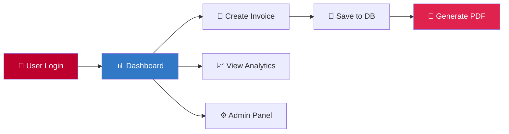

<div align="center">

# 🧾 Invoice Automation Platform

### *Professional invoice management reimagined*

[](https://angular.io/)
[](https://nestjs.com/)
[](https://www.typescriptlang.org/)
[](https://www.postgresql.org/)

**End-to-end invoice management with JWT authentication, real-time analytics, PDF generation, and comprehensive admin tooling.**

[Features](#-features) • [Quick Start](#-quick-start) • [Architecture](#-architecture) • [API Reference](#-api-reference) • [Contributing](#-contributing)

---

</div>

## ✨ User Interface

<div align="center">

<table>
<tr>
<td width="50%">

<p><em>📊 Analytics Dashboard</em></p>
</td>
<td width="50%">

<p><em>📝 Invoice Management</em></p>
</td>
</tr>
<tr>
<td width="50%">

<p><em>🧾 Invoice Details and Pdf Generation</em></p>
</td>
<td width="50%">

<p><em>📄 Create Invoice</em></p>
</td>
</tr>
</table>

</div>

---

## ✨ Features

<table>
<tr>
<td width="50%">

### 🎨 **Modern Frontend**
- ⚡ Angular 20 standalone components
- 🎯 Tailwind CSS + Flowbite UI
- 📊 Interactive charts with Chart.js
- 🔐 JWT-based authentication
- 📱 Fully responsive design

</td>
<td width="50%">

### 🚀 **Powerful Backend**
- 🏗️ NestJS 11 architecture
- 🗄️ PostgreSQL with TypeORM
- 📄 PDF generation with PDFKit
- 🛡️ Role-based access control
- 📈 Real-time analytics endpoints

</td>
</tr>
</table>

---

## 🎯 Highlights



- ✅ **Intuitive UX** - Clean, modern interface for seamless invoice management
- ✅ **Enterprise-Ready** - Robust authentication, validation, and error handling
- ✅ **Analytics Dashboard** - Visualize revenue trends and key metrics
- ✅ **PDF Customization** - Brand your invoices with custom headers and notes
- ✅ **Admin Console** - Comprehensive user and activity management
- ✅ **Type-Safe** - Shared TypeScript models across frontend and backend

---

## 📁 Project Structure

```
📦 invoice-automation-platform
├── 🎨 invoice-app/              # Angular 20 Frontend
│   ├── src/
│   │   ├── app/
│   │   │   ├── auth/            # Authentication components
│   │   │   ├── dashboard/       # Dashboard & analytics
│   │   │   ├── invoices/        # Invoice CRUD operations
│   │   │   ├── admin/           # Admin console
│   │   │   └── shared/          # Shared services & guards
│   │   └── assets/
│   └── tailwind.config.js
│
└── 🚀 invoice-backend/          # NestJS 11 API
    ├── src/
    │   ├── auth/                # JWT authentication
    │   ├── invoices/            # Invoice management
    │   ├── chart/               # Analytics endpoints
    │   ├── pdf/                 # PDF generation
    │   ├── admin/               # Admin operations
    │   └── database/            # TypeORM configuration
    └── test/
```

---

## 🏗️ Architecture

<div align="center">

```
┌─────────────────────────────────────────────────────────────┐
│                     Angular Frontend                        │
│  ┌──────────┐  ┌──────────┐  ┌──────────┐  ┌──────────┐   │
│  │   Auth   │  │ Invoice  │  │Dashboard │  │  Admin   │   │
│  │ Service  │  │ Service  │  │ Service  │  │ Service  │   │
│  └────┬─────┘  └────┬─────┘  └────┬─────┘  └────┬─────┘   │
│       │             │              │             │          │
│       └─────────────┴──────────────┴─────────────┘          │
│                          │                                   │
│                  JWT Auth Interceptor                        │
└──────────────────────────┼──────────────────────────────────┘
                           │
                    REST API (HTTPS)
                           │
┌──────────────────────────▼──────────────────────────────────┐
│                     NestJS Backend                          │
│  ┌──────────┐  ┌──────────┐  ┌──────────┐  ┌──────────┐   │
│  │   Auth   │  │ Invoice  │  │  Chart   │  │   PDF    │   │
│  │ Module   │  │ Module   │  │ Module   │  │ Module   │   │
│  └────┬─────┘  └────┬─────┘  └────┬─────┘  └────┬─────┘   │
│       │             │              │             │          │
│       └─────────────┴──────────────┴─────────────┘          │
│                          │                                   │
│                    TypeORM Layer                             │
└──────────────────────────┼──────────────────────────────────┘
                           │
                           ▼
                  ┌─────────────────┐
                  │   PostgreSQL    │
                  │    Database     │
                  └─────────────────┘
```

</div>

## How It Works

### Authentication Flow

1. **User Registration/Login**:
   - User submits credentials via `Signup` or `Login` components
   - Frontend `Auth` service sends POST to `/auth/signup` or `/auth/login`
   - Backend `AuthService` validates credentials, hashes passwords with bcrypt, and issues JWT
   - JWT payload includes: `userId`, `username`, `role` (user/admin), and expiration
   - Frontend stores JWT in `localStorage` and redirects to dashboard

2. **Protected Route Access**:
   - `authGuard` checks `localStorage` for valid JWT before allowing access to `/dashboard`, `/invoices/*`, `/admin`
   - `authInterceptor` automatically attaches `Authorization: Bearer <token>` to all HTTP requests
   - On 401 responses, interceptor clears token and redirects to login
   - JWT validation includes expiration check and format validation (3-part structure)

3. **Role-Based Access**:
   - `roleGuard` reads `role` from JWT payload and compares against route `data.roles`
   - Admin routes (`/admin/*`) require `role === 'admin'`; regular users are redirected to dashboard
   - Backend `RolesGuard` + `@Roles(Role.Admin)` decorator enforce server-side authorization

### Invoice Management Workflow

1. **Creating an Invoice**:
   - User fills `InvoiceCreate` form with client details, issue/due dates, tax amount, and line items
   - Frontend calculates subtotal (sum of `quantity × unitPrice` for all items) and total (subtotal + tax)
   - On submit, `InvoiceService.create()` sends POST to `/invoices` with validated payload
   - Backend `InvoiceService.createInvoice()`:
     - Generates unique invoice number: `INV-YYYYMM-XXX` (e.g., `INV-202412-042`)
     - Calculates subtotal and totalAmount server-side
     - Auto-determines status: if `dueDate < today` and status is `unpaid`, sets to `overdue`
     - Saves invoice and nested items via TypeORM cascade
   - Response includes full invoice with ID; frontend navigates to detail view

2. **Invoice Status Management**:
   - Status can be: `unpaid`, `paid`, `overdue`, `cancelled`
   - **Auto-overdue logic**: On fetch/update, backend checks if `unpaid` invoice has `dueDate < today` → auto-updates to `overdue`
   - Manual status toggle: Dashboard/List views allow quick toggle between `paid`/`unpaid` via PATCH `/invoices/:id/status`
   - Status calculation respects business rules: `cancelled` and `paid` invoices are never auto-changed to `overdue`

3. **Listing & Filtering**:
   - `InvoiceList` component loads paginated invoices via GET `/invoices?page=1&limit=10&status=paid&clientName=John`
   - Backend `getAllInvoicesForUser()`:
     - Filters by `userId` (from JWT) to ensure data isolation
     - Applies status filter (special handling for `overdue`: includes unpaid past due)
     - Applies case-insensitive `clientName` ILIKE search
     - Returns pagination metadata: `currentPage`, `totalPages`, `totalItems`, `itemsPerPage`
   - Frontend displays table with pagination controls and filter dropdowns

4. **Editing & Deletion**:
   - `InvoiceEdit` loads invoice by ID, allows modification of all fields
   - On update, backend recalculates totals if items changed, re-applies overdue logic
   - Delete action requires confirmation; backend cascades deletion of related invoice items

### PDF Generation Process

1. **PDF Customization**:
   - User clicks "Download PDF" on invoice detail page
   - `Pdf` component opens modal form to collect optional branding:
     - `fromName`: Company name (default: "Your Company Name")
     - `fromAddress`: Multi-line address
     - `fromEmail`: Contact email
     - `extraDetails`: Additional notes/terms
   - Form submission triggers POST `/pdf/invoice/:id` with customization payload

2. **PDF Rendering**:
   - Backend `PdfService.generateInvoicePdf()`:
     - Fetches invoice with items from database
     - Creates PDFKit document (A4 size, 50px margins)
     - Renders sections:
       - **Header**: "INVOICE" title, invoice number, issue/due dates, status
       - **From block**: Customizable company info
       - **Bill To**: Client name, address, email, phone
       - **Items table**: Description, quantity, unit price, total (with rounded corners and gray header)
       - **Totals box**: Subtotal, tax, grand total (formatted as ₹ with Indian number format)
       - **Footer**: Thank you message
     - Streams PDF directly to response with `Content-Disposition: attachment`
   - Frontend receives blob, creates download link, triggers browser download

### Dashboard & Analytics

1. **Statistics Cards**:
   - Dashboard loads via `forkJoin` of two API calls:
     - GET `/invoices/statistics` → returns `totalInvoices`, `paidInvoices`, `unpaidInvoices`, `overdueInvoices`, `totalRevenue`
     - GET `/invoices?page=1&limit=5` → recent invoices for quick access
   - Backend `getInvoiceStatistics()`:
     - Counts invoices by status for current user
     - Sums `totalAmount` of all `paid` invoices for revenue
     - Auto-updates overdue invoices before calculating stats
   - Cards display with color-coded status badges

2. **Income Chart**:
   - `Chart` component uses Chart.js with ng2-charts wrapper
   - User selects period filter: `day`, `week`, `month`, `year`
   - GET `/chart/income?period=month` triggers backend aggregation:
     - `ChartService.getIncomeStats()` uses PostgreSQL `DATE_TRUNC` to group paid invoices by period
     - Returns `{ labels: ['2024-01', '2024-02', ...], values: [15000, 23000, ...] }`
   - Frontend updates line chart with gradient fill, INR currency formatting on Y-axis
   - Chart auto-refreshes when filter changes

### Admin Features

1. **User Management**:
   - Admin dashboard (`AdminDashboard`) loads on `/admin` route (protected by `roleGuard`)
   - GET `/admin/users` returns all users with counts (total, active, admin)
   - GET `/admin/logs` returns recent user creation events (mapped from user `createdAt` timestamps)
   - DELETE `/admin/users/:id` removes user (cascades to invoices via TypeORM `onDelete: 'CASCADE'`)

2. **Access Control**:
   - Backend `AdminController` uses `@UseGuards(JwtAuthGuard, RolesGuard)` + `@Roles(Role.Admin)`
   - Frontend `roleGuard` checks JWT `role` field before allowing route access
   - Non-admin users attempting `/admin` are redirected to dashboard

### Data Flow & State Management

1. **Frontend State**:
   - No global state store (Redux/NgRx); components manage local state via services
   - `Auth` service provides singleton methods for token/username/role access
   - `InvoiceService`, `Chart`, `PdfService`, `Admin` services handle HTTP communication
   - JWT stored in `localStorage`; components read via `Auth.isAuthenticated()` and `Auth.getRole()`

2. **Backend State**:
   - PostgreSQL database stores persistent data (users, invoices, invoice_items)
   - TypeORM entities define relationships: `User` → `Invoice` (one-to-many), `Invoice` → `InvoiceItem` (one-to-many)
   - Database synchronization enabled in development (`synchronize: true`); disabled in production

3. **Request/Response Flow**:
   ```
   Angular Component → Service → HTTP Client → authInterceptor → NestJS Controller
                                                                    ↓
   PostgreSQL ← TypeORM Repository ← Service ← DTO Validation ← Guard (JWT)
   ```

### Key Business Logic

1. **Invoice Number Generation**:
   - Auto-generated on insert via `@BeforeInsert()` hook: `INV-{YYYY}{MM}-{random 3 digits}`
   - Ensures uniqueness via database unique constraint

2. **Total Calculations**:
   - Subtotal: sum of `item.quantity × item.unitPrice` for all items
   - Total: `subtotal + taxAmount`
   - Calculated on both frontend (for preview) and backend (for persistence)

3. **Overdue Detection**:
   - Runs automatically on: invoice fetch, list load, statistics calculation
   - Logic: if `status === 'unpaid'` AND `dueDate < today` → set `status = 'overdue'`
   - Exceptions: `paid` and `cancelled` invoices are never auto-changed

4. **Currency Formatting**:
   - PDF uses Indian Rupee (₹) with `Intl.NumberFormat('en-IN')` for thousands separators
   - Chart tooltips and Y-axis labels format values as `₹1,23,456.78`

---

## 🚀 Quick Start

### Prerequisites

| Tool | Version | Purpose |
|------|---------|---------|
| 🟢 Node.js | ≥ 20.0 | Runtime environment |
| 📦 npm | ≥ 10.0 | Package manager |
| 🐘 PostgreSQL | ≥ 14.0 | Database |
| 🅰️ Angular CLI | Latest | Development tooling |

### Installation

**1️⃣ Clone the repository**

```bash
git clone <repository-url>
cd invoice-automation-platform
```

**2️⃣ Configure environment variables**

Create `invoice-backend/.env`:

```env
# Server Configuration
NODE_ENV=development
PORT=3000

# JWT Configuration
JWT_SECRET=your-super-secret-jwt-key-change-this
JWT_EXPIRES_IN=1d

# Database Configuration
DB_HOST=localhost
DB_PORT=5432
DB_USERNAME=postgres
DB_PASSWORD=your-password
DB_DATABASE=invoice_db
```

**3️⃣ Install dependencies**

```bash
# Backend dependencies
cd invoice-backend
npm install

# Frontend dependencies
cd ../invoice-app
npm install
```

**4️⃣ Verify database connection**

```bash
cd invoice-backend
npm run check:db
```

**5️⃣ Start development servers**

```bash
# Terminal 1 - Backend API
cd invoice-backend
npm run start:dev

# Terminal 2 - Frontend App
cd invoice-app
npm start
```

🎉 **Done!** Visit:
- 🎨 Frontend: [http://localhost:4200](http://localhost:4200)
- 🚀 Backend API: [http://localhost:3000](http://localhost:3000)

---

## 📡 API Reference

### 🔐 Authentication

| Method | Endpoint | Description |
|--------|----------|-------------|
| `POST` | `/auth/signup` | Register new user |
| `POST` | `/auth/login` | Authenticate & receive JWT |

### 📝 Invoices

| Method | Endpoint | Description |
|--------|----------|-------------|
| `GET` | `/invoices` | List invoices (paginated, filterable) |
| `POST` | `/invoices` | Create new invoice |
| `GET` | `/invoices/:id` | Get invoice details |
| `PUT` | `/invoices/:id` | Update invoice |
| `PATCH` | `/invoices/:id/status` | Update invoice status |
| `DELETE` | `/invoices/:id` | Delete invoice |
| `GET` | `/invoices/statistics` | Dashboard statistics |

### 📊 Analytics

| Method | Endpoint | Description |
|--------|----------|-------------|
| `GET` | `/chart/income?period=day\|week\|month\|year` | Income aggregation for charts |

### 📄 PDF Generation

| Method | Endpoint | Description |
|--------|----------|-------------|
| `POST` | `/pdf/invoice/:id` | Generate & download PDF |

### ⚙️ Admin (Protected)

| Method | Endpoint | Description |
|--------|----------|-------------|
| `GET` | `/admin/users` | List all users |
| `GET` | `/admin/logs` | View activity logs |
| `DELETE` | `/admin/users/:id` | Delete user |

> 🔒 All endpoints (except auth) require `Authorization: Bearer <token>` header

---

## 🧪 Testing & Quality

```bash
# Frontend Tests
cd invoice-app
npm test                    # Run unit tests
npm run test:coverage       # With coverage report

# Backend Tests
cd invoice-backend
npm test                    # Unit tests
npm run test:e2e           # End-to-end tests
npm run test:cov           # Coverage report

# Linting
npm run lint               # Check code quality
```

---

## 📦 Production Build

### Backend

```bash
cd invoice-backend
npm run build
npm run start:prod
```

⚠️ **Important:** Set `NODE_ENV=production` and disable `synchronize` in TypeORM config

### Frontend

```bash
cd invoice-app
npm run build
```

Output location: `invoice-app/dist/invoice-app/browser/`

---

## 🛠️ Tech Stack Deep Dive

<table>
<tr>
<td width="50%" valign="top">

**Frontend Technologies**
- 🅰️ Angular 20 - Standalone components
- 🎨 TailwindCSS 3 - Utility-first styling
- 🌊 Flowbite - UI component library
- 📊 Chart.js - Data visualization
- 🔄 RxJS 7 - Reactive programming
- 🎯 TypeScript 5.9 - Type safety

</td>
<td width="50%" valign="top">

**Backend Technologies**
- 🚀 NestJS 11 - Progressive Node.js framework
- 🗄️ TypeORM 0.3 - ORM with PostgreSQL
- 🔐 Passport JWT - Authentication
- 📄 PDFKit - PDF generation
- ✅ class-validator - DTO validation
- 🔒 bcrypt - Password hashing

</td>
</tr>
</table>

---


---

## 🤝 Contributing

Contributions are welcome! Please follow these steps:

1. 🍴 Fork the repository
2. 🌿 Create a feature branch (`git checkout -b feature/AmazingFeature`)
3. 💾 Commit your changes (`git commit -m 'Add some AmazingFeature'`)
4. 📤 Push to the branch (`git push origin feature/AmazingFeature`)
5. 🔀 Open a Pull Request

---

## 📄 License

**Private / Unlicensed**

This repository is currently marked as private. All rights reserved. Please do not distribute without explicit permission.

---

<div align="center">

### 🌟 Star this repo if you find it useful!

Made with ❤️ by the Invoice Automation Team

[⬆ Back to Top](#-invoice-automation-platform)

</div>
